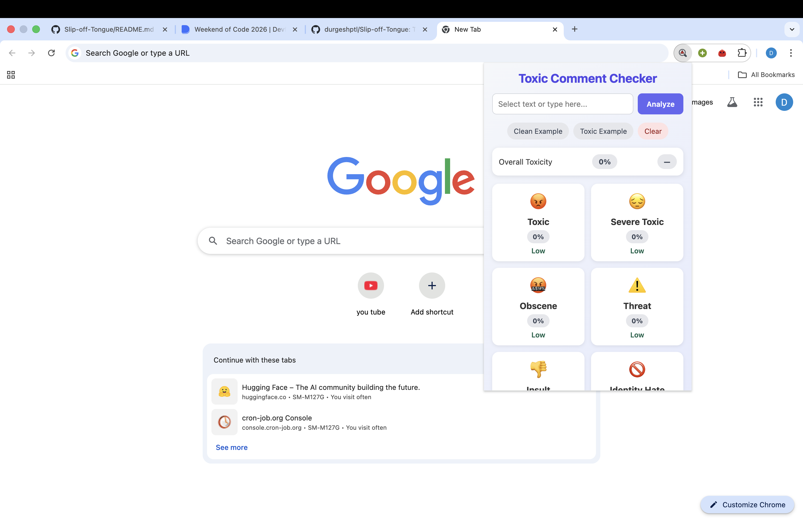

# VERSION 2 [BASIC MODEL+RFC+DEPLOYMENT+EXTENSION ADDED]

---

Turing's Playgroung Project MNNIT Allahabad

# Multilabel Toxic Comment Classification System

This project is an **AI-based Toxic Comment Classification system** that detects different forms of toxic behavior in user-generated text.  
The system has been developed step-by-step, starting from a classical machine learning approach and then upgraded to a **modern Transformer-based architecture** for better scalability and future multilingual support.

---
### REST API[server of version1]

https://slip-off-tongue.onrender.com/  
---

### EXTENSION
### LOGO:  

### NORMAL STATE

  

### 🤫RESULT:  

   

