# FULL PROJECT OVERVIEW[V1+V2+V3 soon]
Turing's Playgroung Project MNNIT Allahabad

# Multilabel Toxic Comment Classification System

This project is an **AI-based Toxic Comment Classification system** that detects different forms of toxic behavior in user-generated text.  
The system has been developed step-by-step, starting from a classical machine learning approach and then upgraded to a **modern Transformer-based architecture** for better scalability and future multilingual support.

---
## Deployment Link  
https://slip-off-tongue.onrender.com/  
---

## 🔁 Project Progress Overview  

### 🌐Web Page
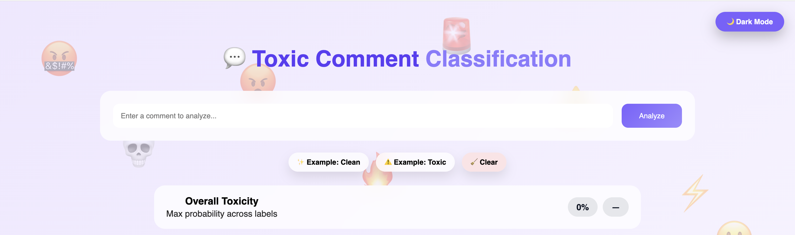  

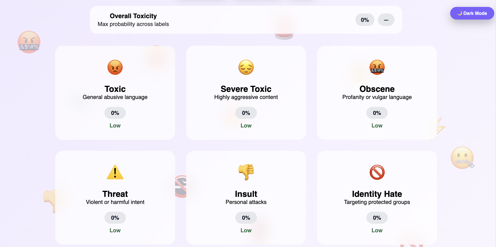   

#### 🤫Result:  

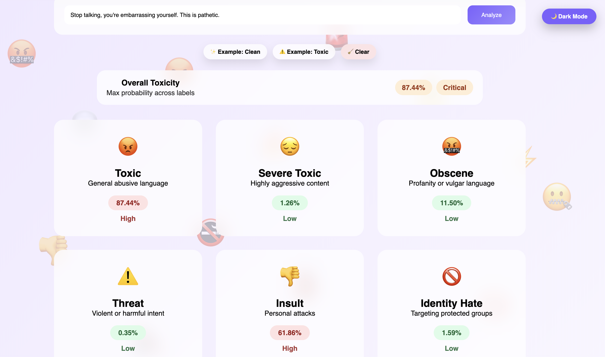

---

### Phase 1: Classical Machine Learning (Baseline Model)
The initial version of the project was built using traditional NLP and machine learning techniques.
1. Logistic Regression + OvsR  
2. Multinomial Naive Bayes Classifier

**Approach:**
- Text preprocessing:
  - Cleaning
  - Stopword removal
  - Stemming
- Feature extraction using **TF-IDF**
- Multi-label classification using:
  - Logistic Regression (One-vs-Rest)
  - Multinomial Naive Bayes

**Toxicity labels:**
- `toxic`
- `severe_toxic`
- `obscene`
- `threat`
- `insult`
- `identity_hate`

This phase helped establish a complete end-to-end pipeline for toxic comment detection.

---
### Dataset link  
https://www.kaggle.com/datasets/julian3833/jigsaw-toxic-comment-classification-challenge?select=train.csv   
---

## 📸 Screenshots

>Visual walkthrough to the training data

### 📊Training Data Overview  
#### Total Row and Colom:

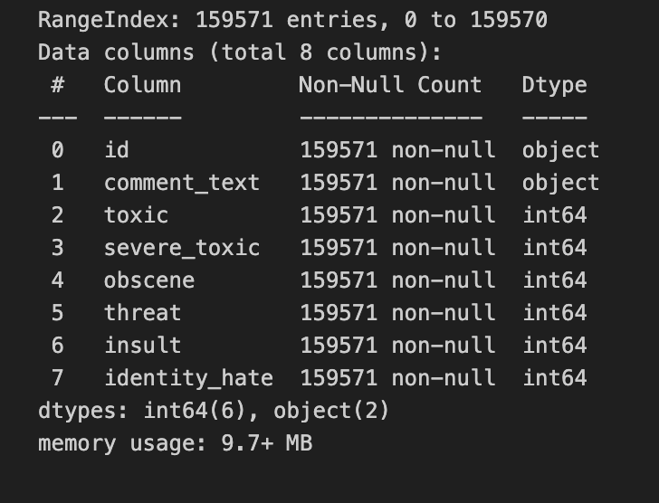   

#### Labels:  

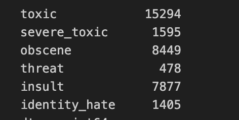   

#### Train data:  

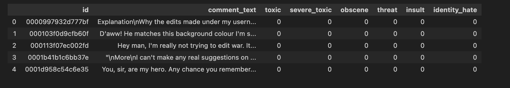

### 📈📉Visualization
#### Label-Counts:  

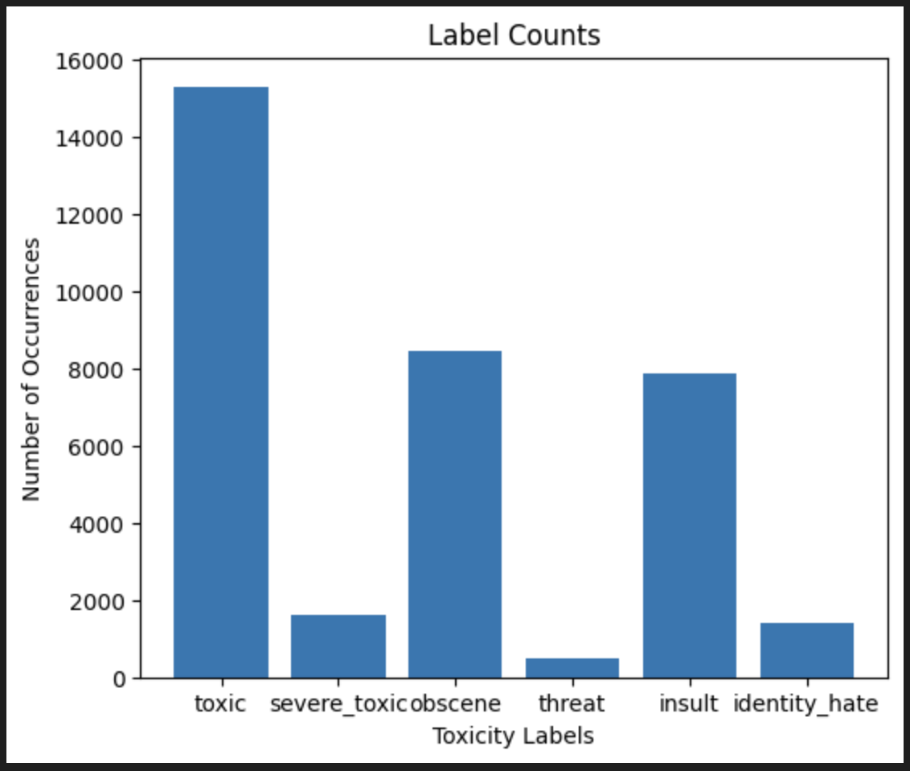   

#### Comment-sizes:  

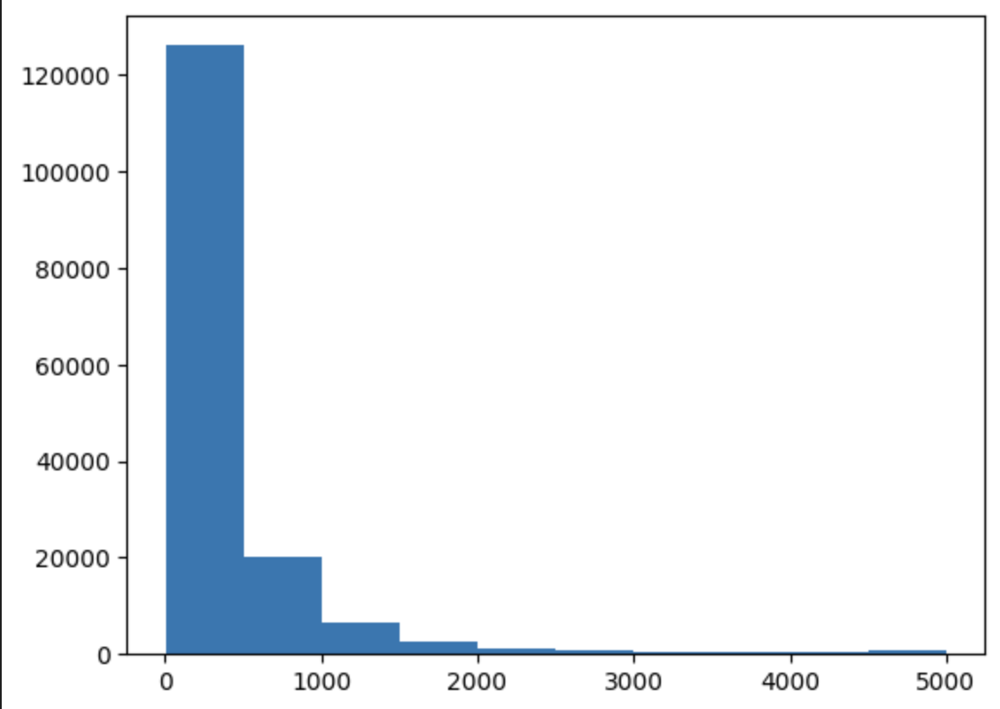   

#### Correlation of features:  

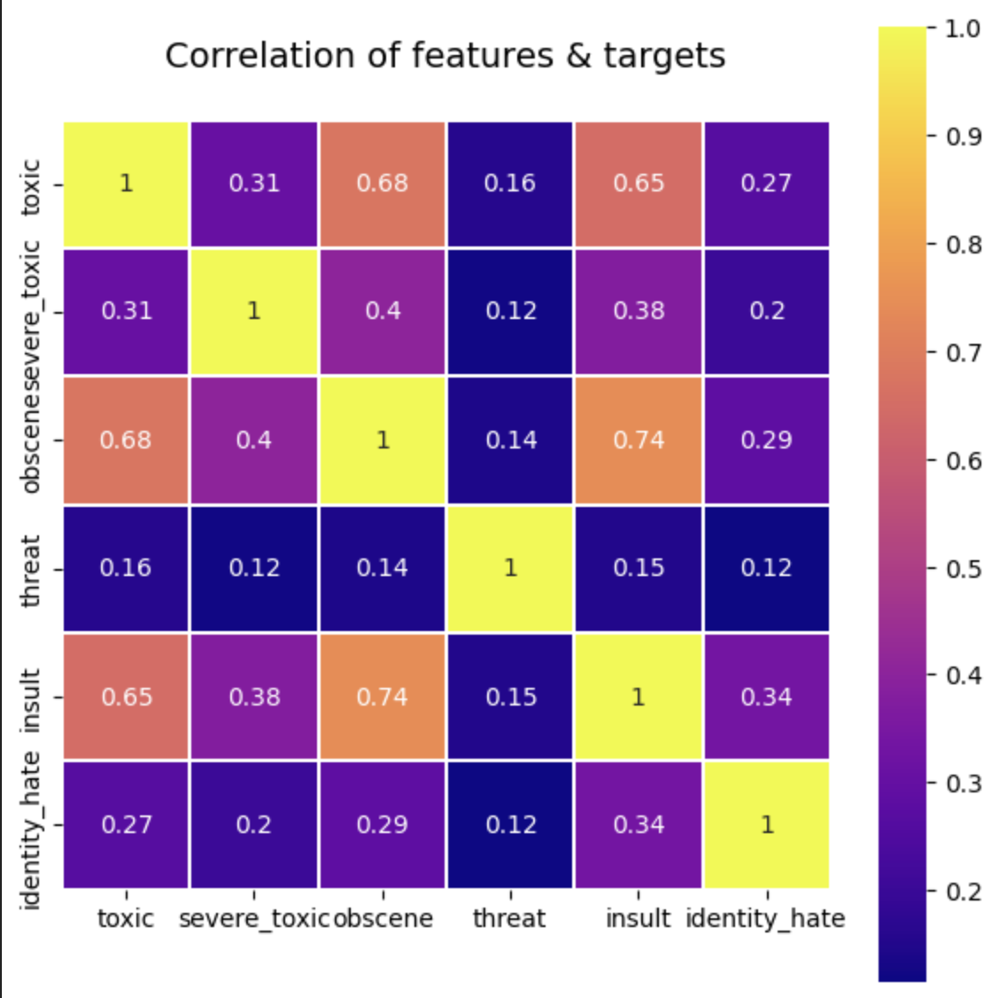  

### 🔁Cloud View of data[Most common word]
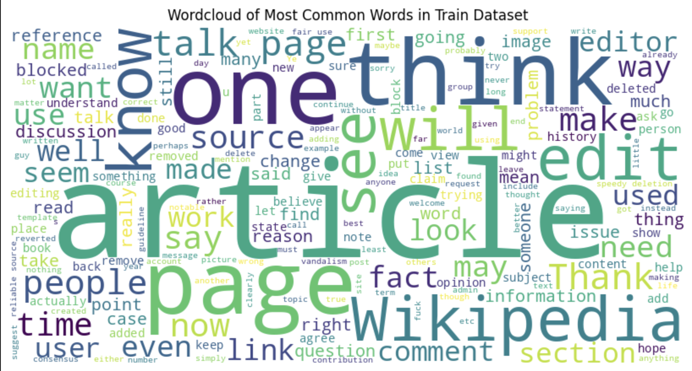   

#### 😳Toxic:  

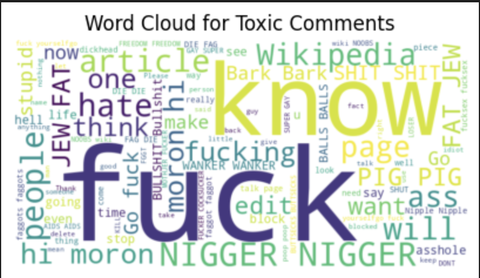   

#### 😫Sevre-Toxic:  

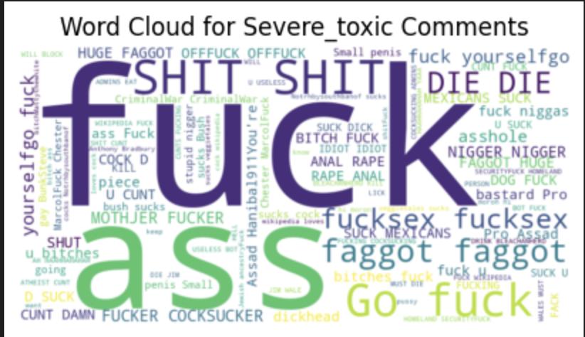   

#### 💀Obscene:  

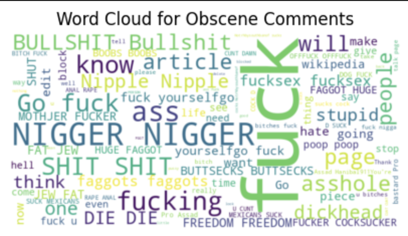   

#### 😖Threat:  

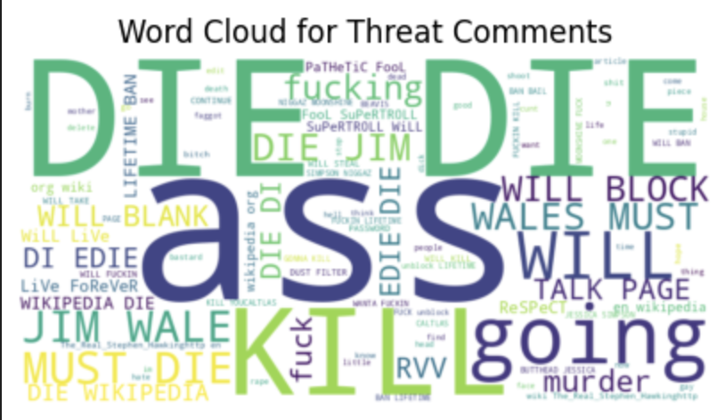   

#### 😠Insult:  

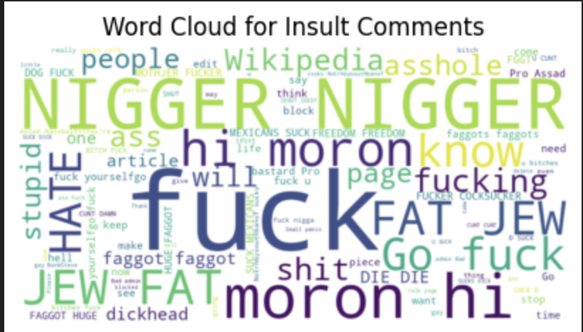   

#### 👎Identity Hate:  

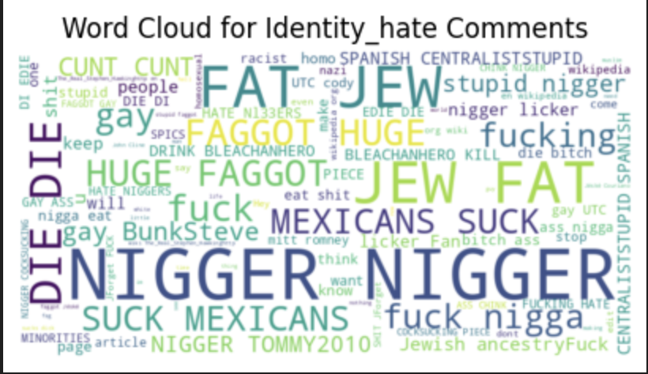

### 🧹🧹Comments after Data cleaning 
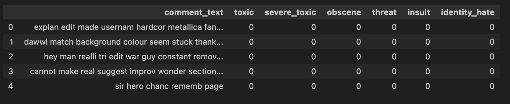  
 
### 🔎Classification Report  
1. Logistic Regression + OvsR  
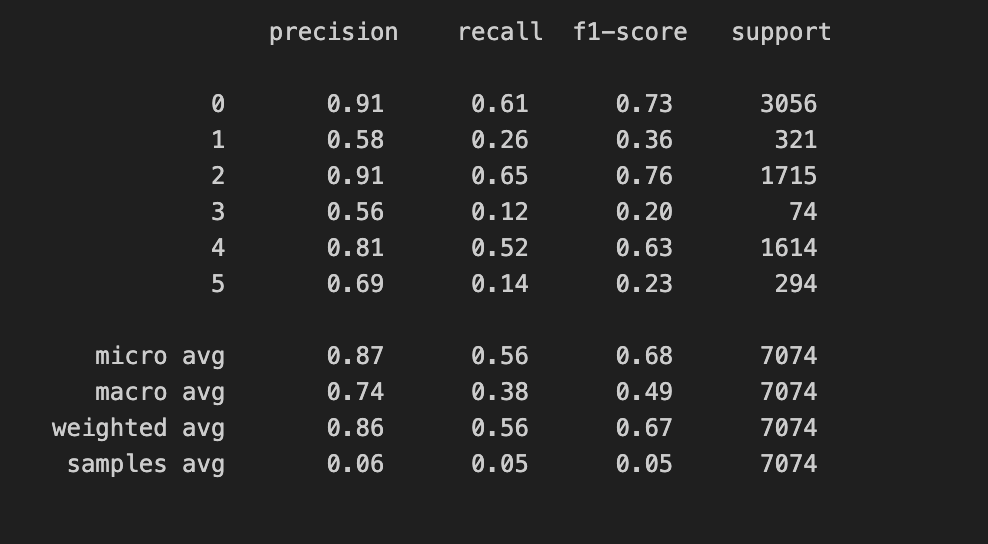

3. Multinomial Naive Bayes Classifier:
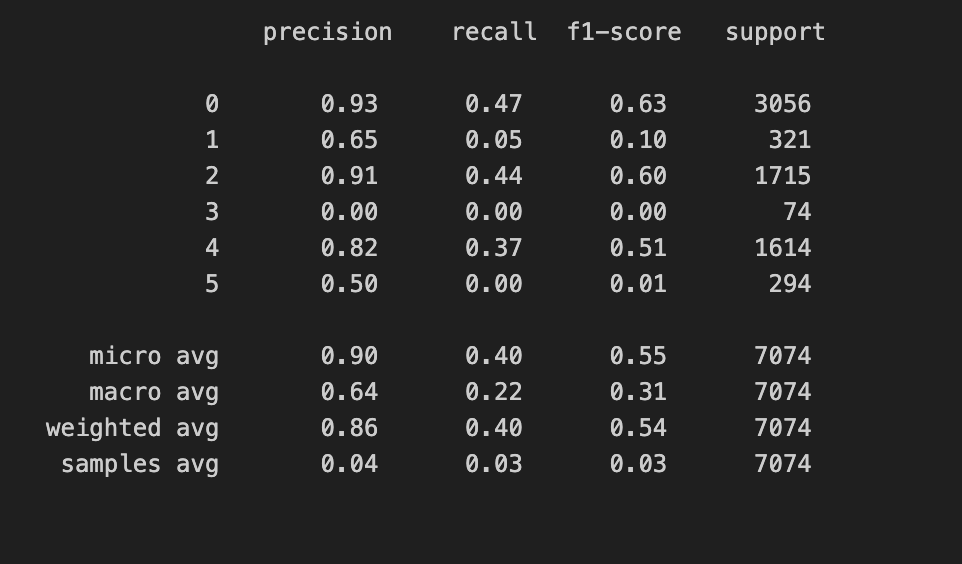   

---

### Phase 2: Transformer Upgrade (Current Implementation)
To improve model performance and make the system **future-ready**, the project has been upgraded to use a **state-of-the-art Transformer model**.

### ✅ **XLM-RoBERTa (base)**
- A multilingual Transformer model trained on over **100 languages**
- Provides deep contextual understanding of text
- Significantly improves performance over TF-IDF-based models
- Widely used in modern NLP research and industry applications

---

## 🧠 Why Upgrade to XLM-RoBERTa?
- Better semantic understanding compared to bag-of-words methods
- Handles context, word order, and sentence meaning effectively
- Produces **probability-based outputs** for each toxicity category
- Designed to scale to multilingual and code-mixed data in later stages

---

## 📊 Training Setup
- Dataset: English toxic comment dataset (multi-label format)
- Tokenization: `xlm-roberta-base` tokenizer
- Classification type: **Multi-label**
- Loss function: Binary Cross-Entropy with Logits
- Evaluation metric: Macro F1-score
- Output: Sigmoid probabilities converted to percentages

---

## 💾 Model Storage
Unlike classical models that rely on pickle files, the Transformer model is saved using the Hugging Face format:
- Model weights
- Configuration
- Tokenizer files

This makes the model easier to reuse, extend, and integrate into production systems.

---

## 🔮 Future Scope
The current architecture allows seamless extension to:
- Hindi language data
- Code-mixed (Hindi + English) comments
- Larger multilingual moderation systems

These enhancements are planned for later phases without changing the overall system design.

