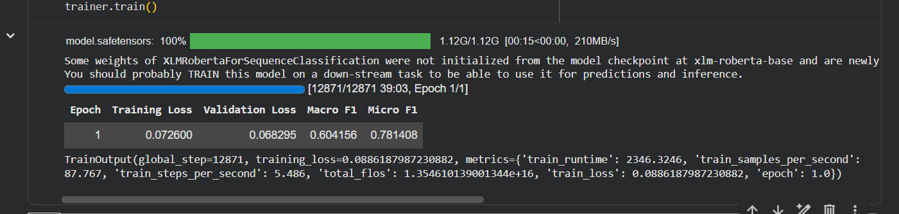
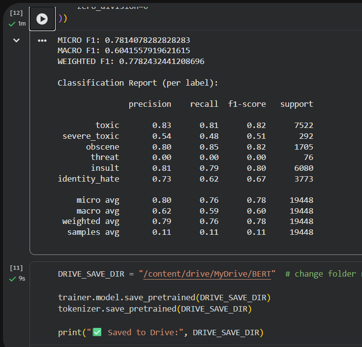
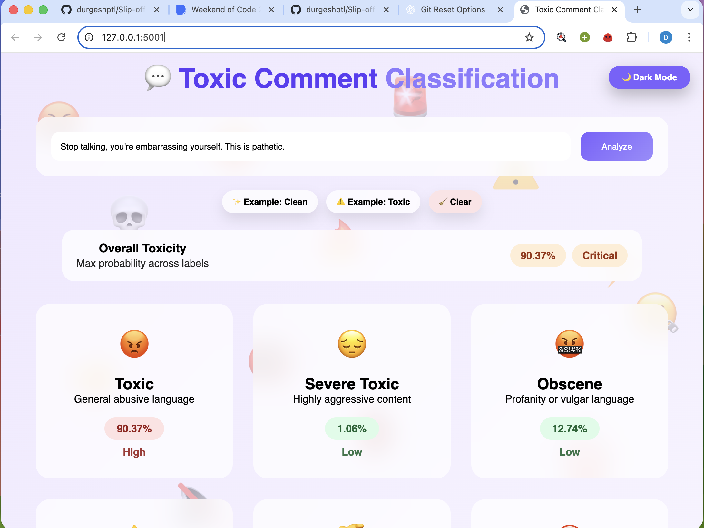
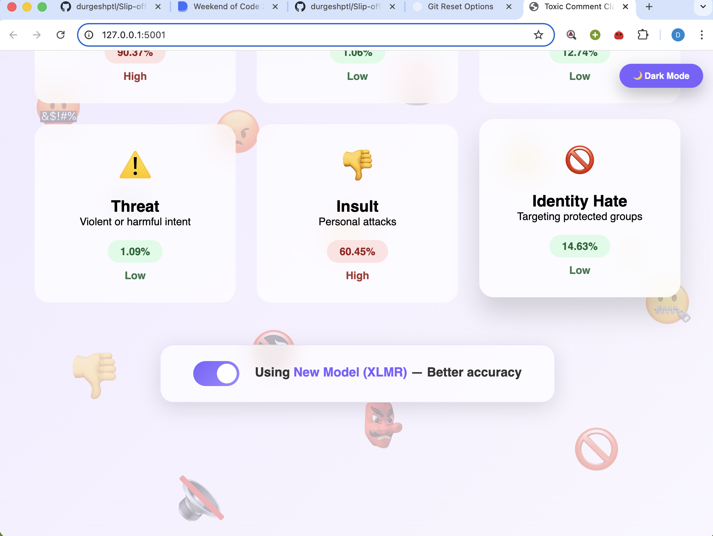
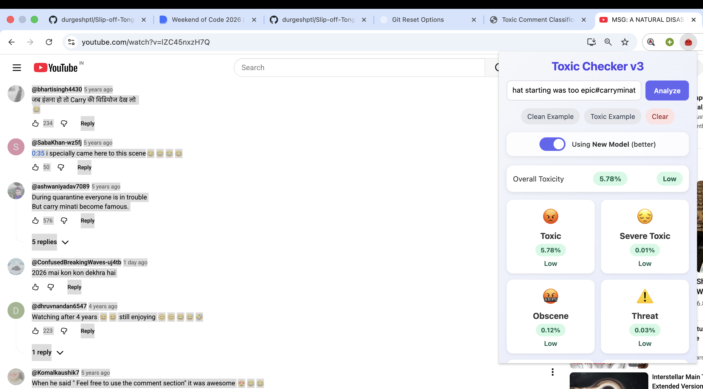

# VERSION 3 [BASIC + NEW MODEL + LOCALLY DEPLOYED + EXTENSION ADDED + HINGLISH DATASET TRAINED]
USES LOCAL API INSTEAD OF SERVER OF VERSION2

---

Turing's Playgroung Project MNNIT Allahabad

# Multilabel Toxic Comment Classification System

This project is an **AI-based Toxic Comment Classification system** that detects different forms of toxic behavior in user-generated text.  
The system has been developed step-by-step, starting from a classical machine learning approach and then upgraded to a **modern Transformer-based architecture** for better scalability and future multilingual support.

---
### Transformer Upgrade (Current Implementation)
To improve model performance and make the system **future-ready**, the project has been upgraded to use a **state-of-the-art Transformer model**.

### ✅ **XLM-RoBERTa (base)**
- A multilingual Transformer model trained on over **100 languages**
- Provides deep contextual understanding of text
- Significantly improves performance over TF-IDF-based models
- Widely used in modern NLP research and industry applications

---
### MODEL TRAINING

### MODEL SCORE

### LOCAL RUN

### TOGGLE TO JUMP OLD

### EXTENSION ON NEW MODEL

